# FOS_UAV

The aim of this project is to develop an open source aerial mapping platform using standard hardware and to develop a workflow from data acquisition to data processing. 

FOS UAV is part of the Drone Research Program by [ICFOSS](https://icfoss.in/) (International Center for Free and Open Source Software)

## Overview

Most UAV's today are multirotors, they have the advantage of being able to hover and carry more payload like sensors and other auxilaries. But with the current battery technology, multirotors have a flight time in the range of 15- 20 mins, without compromising on the payload. They make good inspection drones in tight spots and hard to reach places. But because of the way they fly, they brun through a lot of  power, hence limiting the flight time and maximum range.

Fixed winged aircrafts fly on the principle of aerodynamic lift and are far more efficient at covering ground than multirotors. Even though they are considerably harder to design and build, they make up for with efficiency.

Our goal is to build a suitable fixed wing platform that can carry the necessary payload and provide usable data for arieal mapping. The craft needs to carry a good GPS system, a downward facing camera for taking ../Images, and be able to fly missions autonomysly.

Our constrains being, it must be simple to make, and easy to use. All the hardware and software are low cost and open-source, without sacrificing saftey and usability.

## Related projects
 [**4-Axis Hotwire Foam Cutter**](https://github.com/rahulsarchive/4AxisFoamCutter)  
 [**CNC Drag knife**](https://github.com/rahulsarchive/cncdragknife)  

## Version 1.0 (Phenoix, Cark Y foam wing)

Wingspan: 800mm  
Sweep: 30 deg  
AUW: 870g  
Power plant: 2212 1000kv motor (10x4.7 prop)  

This is our first attempt at making a flying wing. This wing will be made from styrofoam and since a hot wire cutter is the most efficient way to cut foam, we decided to built a [4-axis CNC hotwire cutter](https://github.com/rahulsarchive/4AxisFoamCutter) to help us make the wing cores. Its been a blast making it, see the repo for the documentation.
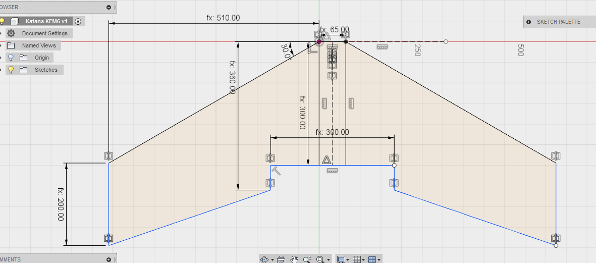

After a bit of reasearch on fying wings, we settled on the parameters and started working on the design.The wing will have a wingspan of 800mm, swept back at and angle of 30deg and have a blunt nose fuselange in between to carry all the payload. The hot wire cutter helped us tremendousely in cutting out the wing cores. 

For additional strenght we decided to do a composite on the wing cores with wood glue and paper towels. This gave us a hard and rigid outer shell which can take the impact of landings. This shell was coverd with a layer of packing tape to seal all the rough edges and then a layer of vinyl tape to provide some colour.

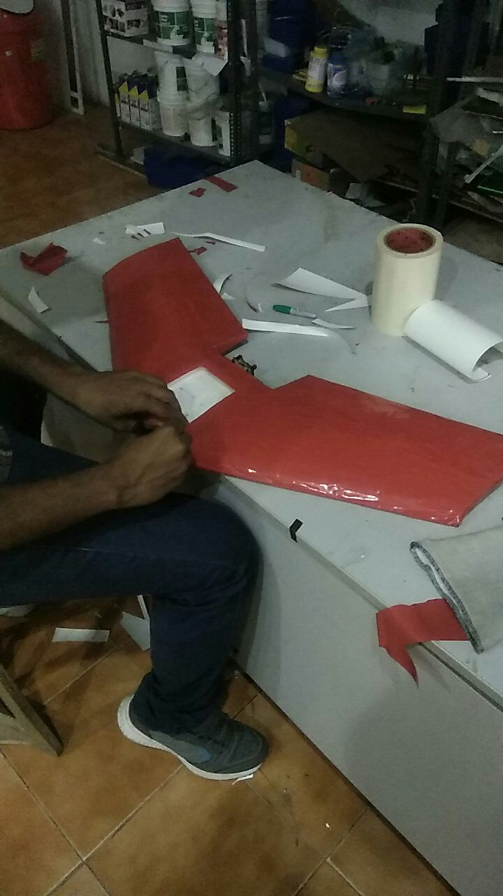
The wing is very light weight with the foam cores and has a tough shell to protect it in impacts. The motor mounts were laser cut on 3mm birch wood and joined to the wing with glue. Though originally desinged for a 2205 2600kv motor. In the end we had to go with a 2212 1000kv motor running a 10x4.7 prop.

We realized one problem when tried to balance the CG of the wing. There was not enough weight on the front to get the CG where we wanted, even with the bigger batttery the plane was still tail heavy. For the intial maiden we added bit of nose weight to bring the CG forward.

The maiden did not go successfully. It was very difficult to control and came down nose first. The wing was very heavy and barely had enough thrust to get it flying. Especially with all the drag from the large front bumpers. We realized that even though we designed for a 30deg sweep angle, after construction, the sweep was around 24deg. This pused the CG point forward and there was not enough weight in the front to balance it.

we tried putting a flight controller in it to help in stablizing the craft. We were able to fly with the help of flight controller. The model is still too tail heavy and the plane does not have enough thrust to carry the extra nose weight.

### Note 

1. The single biggest factor that controls the characteristics of a flying wing is the CG.  
2. Wings are very sensitive in the pitch axis and sluggish in the roll axis.  
3. Manually flying them are hard, unless you have a lot of experience or very low wing loading.  
4. Adding a flight controller helps with stability and leveling the aircraft.  

## Version 1.5

This is our first version of our wing using a KFm6 airfoil. The center fuselage is designed to carry a camera, two 2500mah lipo, the flight controller and the motor. It needs to be strong to survive impacts and protect the electronics.

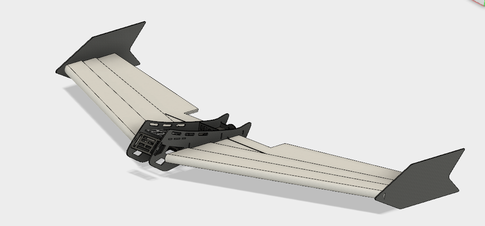

We decided to keep this on hold until we test out the KFm airfoils on more simpler airframes. 

## Version 2.0 (Albatross, KFM6 wing)

Wingspan: 1000mmm   
Sweep: 35 deg  
root chord: 300mm
tip chord: 250mm
AUW: 1200g  
Power plant: 2826 1500kv motor (9X6 prop) 

Learning from our previous wing build, we decided to increase the sweep angle to 35 deg to push the COG backwards, so the wing would balace with less weight upfront. This wing will be an all foam construction and will accomodate a battery plate to house all the electronics.

The wing will have six layers in total, two base layers and two KFm steps on top and bottom. With all the extra foam, the construction will be heavy.

The motor mount is designed to sequrely hold on to the layers of foam. Its a minimal design and provides resonable sturdiness when attached to the foam.

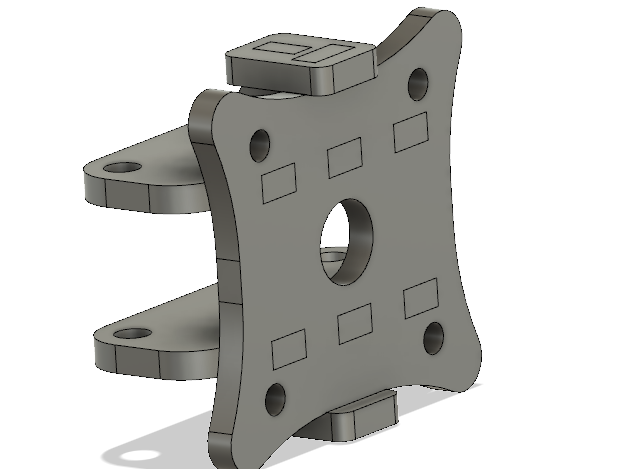

The two locking clips on the top and bottom, provides assurance that the motor plate won't come loose from the assembly. The entire part is covered in a syntetic resin to provide strength and resist vibration.

The 3D model is converted into **DXF** format and made sutitable for CNC cutting. The design is cut on **Shopbot PRS alpha 3-axis CNC mill** using the [CNC Drag knife](https://github.com/rahulsarchive/cncdragknife) we designed. 

We did not have depron foam available with us, so we decided to use **Coroplast** for the construction. It's heavier than depron but is also much stronger, it can take impact well and binds well with hotglue and syntetic rubber adhesives.

The final assembly with all the layers stuck together.

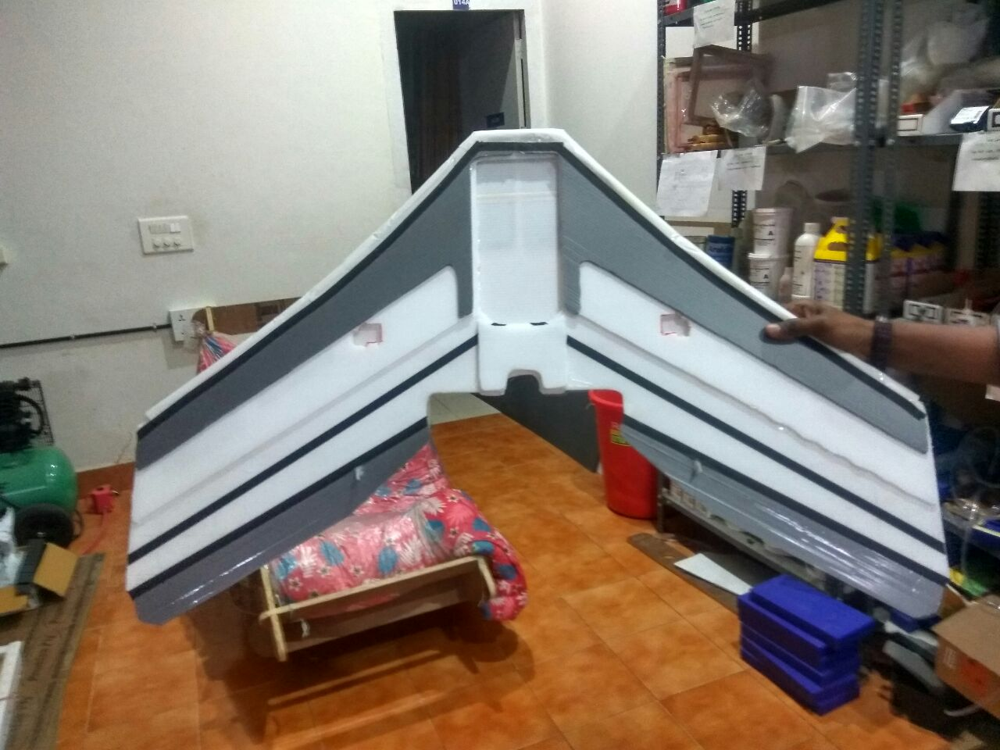

The maiden went beautifully, the KFm performed well, the wing resisted tip stalling and glides like its on rails.Because of the sweep, the COG balances prefectly with a 3800mah 3S lipo. Takes off at about 70% throttle and cruises at 50%. Since we used coroplast, the wing is a bit heavy for a 1m wing span model, as such needs to fly a bit faster to maintain altitude. 

The wing loading on the plane is a bit higher with an area of 28dm^2 and AUW of 1200g. This needs an expert level of control to keep the craft in the air.

### Note

1. Sweep provides dihedral stability and COG leverage.
2. Coroplast is heavier, when desigining a model, built it at 1.5 times scale.
3. 1m wingspan and 28dm^2 wing area is not enough for a 1.2kg model. Wing cube loading puts it in the acrobatic range.
4. choose a motor with a thrust greater than the weight of the model.

## Version 2.1 (TomCat, KFM4 Wing)

Wingspan: 1200mmm   
Sweep: 35 deg  
Root chord: 320mm
Tip chord: 260mm
AUW: 1000g  
Power plant: 2826 1500kv motor (9X6 prop) 

We decided to built a bigger and lighter version of the wing, it will have lighter wing loading and can fly more slowly.

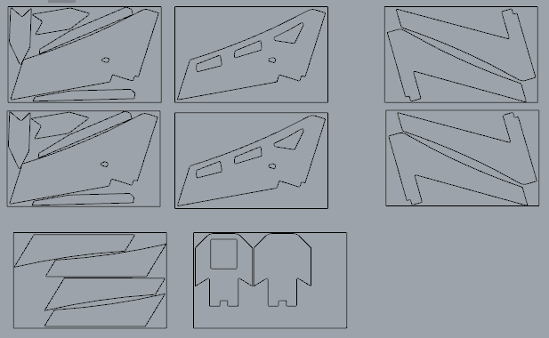

The wing is made from **5mm depron** sheets, depron is much more easier to work with than coroplast. It is lighter and can be bend when heated. The wing is made by stacking 4 layers of depron sheets to from the KFm4 airfoil.
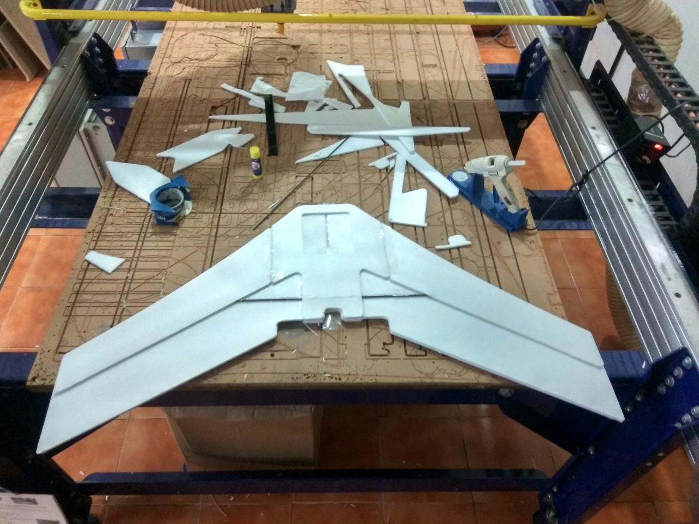

The layers are stuck together with hotglue and syntetic resin. There is thin laminating layer on the depron which provides strength, if you remove the layer by sanding, it will weaken the structure.

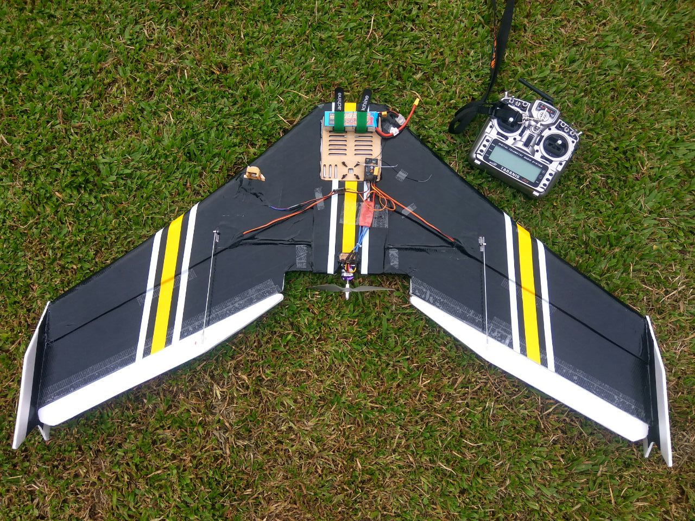

We laminated the wing with black packing tape. The tape provides the strenght for the model, we used a thicker tape and the weight of the model increased by 100g. Light weight packing tape would be a better choice.

The stripes are added for effect. It does make the wing look cool.

The wing flies beautifully, it glides forever. Very good slow flying characteristics and controllability. When flying slow wind does push the craft around, buut once you get some speed it flies like an arrow. Very little relex on the elevons was need to keep it level.

### Note

1. Don't be afraid of building bigger wings, they have far more stable and have good slow flying characteristics.
2. Hot glue is heavy, use it sparingly.
3. Depron bonds well with polyurethane glue, for lighter build, can use ordinary glue stick.
4. Built elevons a bit bigger to increase responsiveness at slow speeds.

### Version 3.0 (OrangeFury)

Wingspan: 1400mmm   
Sweep: 30 deg  
Root chord: 380mm
Tip chord: 220mm
AUW: 1500g  
Power plant: 3530 1400kv motor (9X6 prop) 

This will be a slightly bigger wing than the previous one, we want it to carry a downward facing camera for arieal mapping purposes. 

It will be a heavier version witha slighly longer wingspan and reduced sweep angle to bring the CG forward as we will be putting a 6000mah (2X3S) battery and Gopro in the front.

The battery plate with the provisons for attaching two Gopro cameras, one facing downwards and other facing forwards. It will support 2X 2600 mah batteries, a flght controller and receiver.

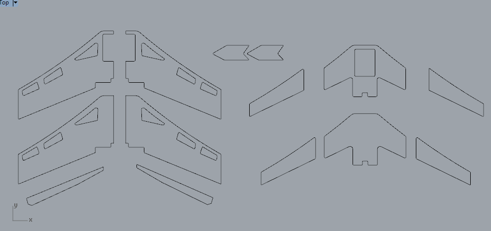

The design made ready for cutting in the CNC machine using a Drag Knife. 

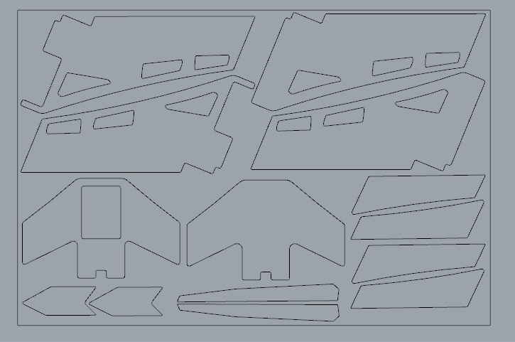

The parts are split apart and arranged to provide the most economical use of material and provide strength where needed and reduce weight were not needed.

The motor plate with the larger base and  stronger supports for the bigger motor.

The wing is fitted with the MatekF405 flight controller, an Frsky S8r radio, SIK radio telemetry, Skywalker 60A ESC, DYS 3536 1100Kv motor

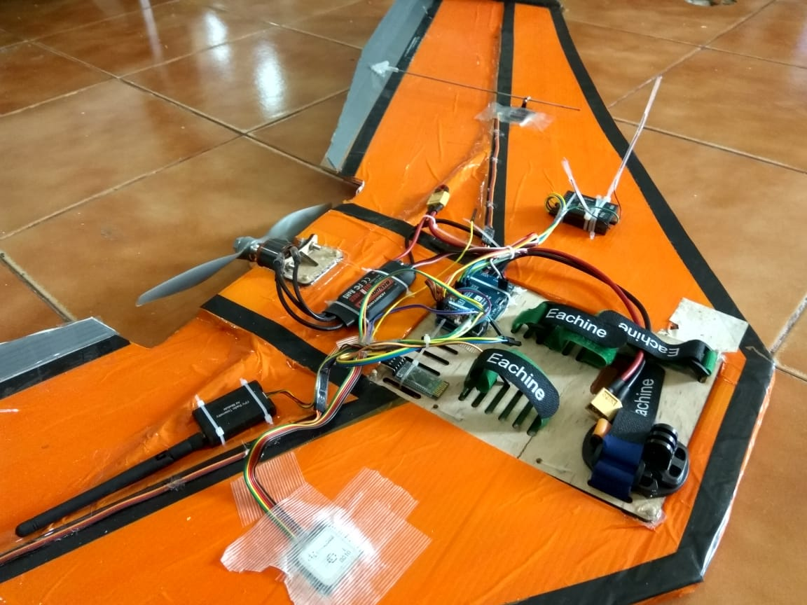

The wing was big and heavy, but the material choice was poor, the coroplast was sagging at the ends, the frame as a whole is not rigid enough and the flight chracteristics were not as good as expected, its a bit tail heavy.

### Note

1. Coroplast is not suited for bigger wingspan.
2. The sweep angle was too shallow, and the plane became tail-heavy.
3. Airfoil benefits of KFm4 were missing, it behaved like a plank.

## Version 4.0 (Stingray, KFM6)

Wingspan: 1250mmm   
Sweep: 30 deg  
Root chord: 380mm
Tip chord: 220mm
AUW: 1300g  
Power plant: 3530 1400kv motor (9X6 prop) 

Considering all the things we learned from the previous model we decided to build a new model with some modifications like, switching from to a KFm6 airfoil and building the plane out of 5mm Depron, which is much lighter.

Cutting Depron in Shopbot CNC mill. The frame is made form multiple sheets stacked on top.

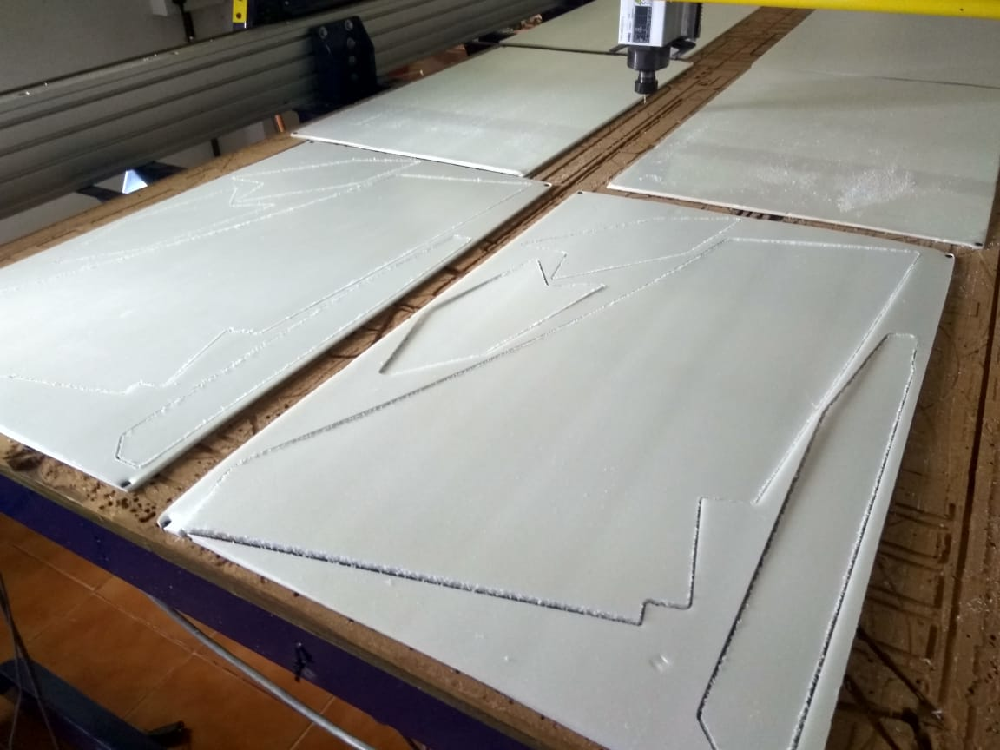

The arrangement showing how the pieces fit together.

The model after assembling.

Finishes sticking all the parts together and made a fuselage out of depron for housing all the electronics.

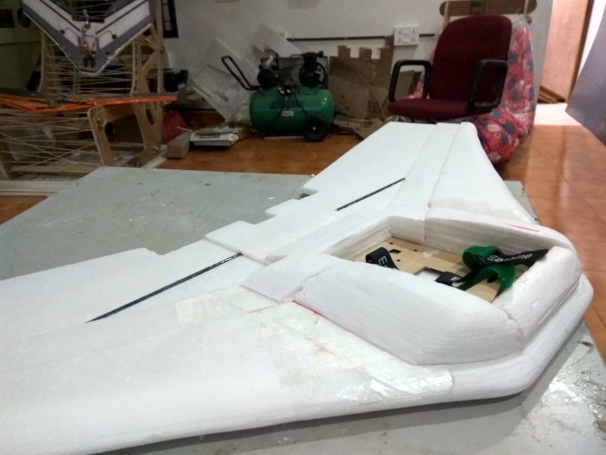

The Elevons sanded to give the airfoil shape. and attached to body uing Nylon hinges.

The finished airframe with a painted body and tape covering to protect it from damage.

The wing flies well, it needs a 5000mah battery and a Gopro in front to balance out the CG but once its balanced, it flies well, good glide slope and stall characteristics. The KFm6 seems to work well with this airframe.

## Resources 

