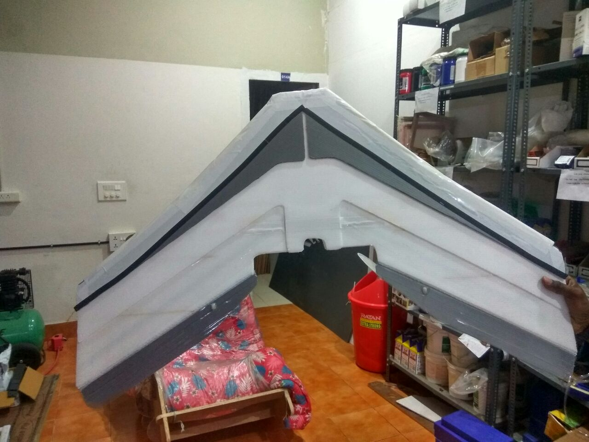

# Pt_UAV
A DIY, low cost, Fixed-wing aerial reconnaissance and mapping platform

Modules
Main readme (overview)
design documentation (readme)
hardware selection, link to google sheet
basic info on design parameters and areodynamic principles
build log and progress.

Most UAV's today are multirotors, they have the advantage of being able to hover and carry more payload like sensors and other auxilaries. But with the current battery technology, multirotors have a flight time in the range of 15- 20 mins, without compromising on the payload. They make good inspection drones in tight spots and hard to reach places. But because of the way they fly, they brun through a lot of  power, hence limiting the flight time and maximum range.

Fixed winged aircrafts fly on the principle of aerodynamic lift and are far more efficient at covering ground than multirotors. Even though they are considerably harder to design and build, they make up for with efficiency.

Our goal is to build a suitable fixed wing platform that can carry the necessary payload and provide usable data for arieal mapping. The craft needs to carry a good GPS system, a downward facing camera for taking images, and be able to fly missions autonomysly.

Our constrains being, it must be simple to make, and easy to use. All the hardware and software are low cost and open-source, without sacrificing saftey and usability.

## Related projects
 [**4-axis Hotwire cutter**](https://github.com/rahulsarchive/4AxisFoamCutter)  
 [**CNC Drag knife**](https://github.com/rahulsarchive/cncdragknife)  

# Mapping Process

The mapping is done by a process called **Photogrametry.** The UAV carries a camera which is angled down to take photos of the ground when the crafts flies overhead. The UAV then flies along a defined GPS way-point mission which covers the area to be apped with sufficient overlap. A software then reads all the images and then stiches them into an 3 dimensional orthomosaic.

Multiple data can be infered from the orthomosaic like, ground elevation, water level, cubic volume of materials. With suffient overlap and good camera altitudes, centimeter level accuracy can be obtained. But inorder for the process to work, the UAV must provide reasonably stable data over the entire course of the mission.

# Software

## INAV

Inav is a flight control software, which was forked from Clean Flight. The software supports both multi-rotors and fixed wings and has good GPS modes like Return to launch (RTH) etc. The software has a mission planner, which allows for setting full autopilot GPS way-point navigation. It supports a variety of Flight controller boards and is actively being developed by the community.

## Open drone maps

OpenDroneMap is an open source toolkit for processing aerial drone imagery. Open drone maps turns the images captures by the drone into three dimensional geographic data that can be used in combination with other geographic datasets.

it can process a collection of images into point clouds, Digital surface models, Digital Elevation Models etc.

## Mission planner

# Hardware

## Design consideration

The flight characteristics need to be kept in mind when choosing an aircraft. We wanted to keep thing simple, and minimze the number of moving components. Hence no tail. The aircraft will be a flying wing,simple and monolithic in construction, good performance and agility.

### Wing Aerodynamics 101

The two most important parameters when desiging an aircraft are the **Center of Gravity (COG)** and the **Center of Pressure (COP)**. The COG is the point where the weight of the aircraft acts and the COP is the point where the aerodynamic lift forces act. For the plane to be  stable, the COG must be in front of the COP. But this means the airplane has a tendency to nose down when flying. Thats where the tail comes in, the tail on a conventional airplane is set at a slightly downward angle compared to the wing, a term known as Decolage.

So the wing is lifting up and the tail is pushing down to keep the plane stable. If the COG is too far forward the wing has to push down even more and the wing has to make more lift to counter this effect. The inverse is also true, if the COG is too far back then the tail has to push up to keep the plane level, this is not a stable condition and its very difficult to fly a tail-heavy plane.

A wing emulates a stable flying conditon by having a forward COG and using its Elevons (Elevator+ Aeilerons) to pitch the wing up, A term known as **Reflex** in which the elevons are kept at a slight up to push the tail down and pitch up the wing. This is not without consequences, the more forward the COG the more the elevons have to pitch up, there by creating more induced drag. The next parameter which influences the COG and hence the stability is the **Sweep Angle**.

 Sweep is importart because it provides leverage for the COG to act. The COG needs to be at about 25-30% of the chord, in a rectangular wing, this is very close to the leading edge and will not provide enough leverage to balance the COG, so we need a long fuselage in front of the wing to carry the weight.

In a wing, the CG needs to be at about 20-30% of the **Mean aerodynamic chord**, whcih takes into account the root and tip chord and the sweep angle. In simple terms, the more the sweep, the farther back the COG can be and the more leverage you can get. But the more the sweep the less the lift is produces per wingspan. Sweep also has another effect, it acts like a **Dihedral**

A **Dihedaral** is a slight angle between the wings to provide stability. When one wing dips, it produces more lift than the other wing and the aircraft comes back to level. A side effect being, it will cause the wing to wobble, as the side facing the wind will have more lift than the trailing wing.

### Wing parameter selection
sweep, chord, CG, Airfoil, Elevon) General paramters and how they affect flight characterisitcs.

Flying wings are a lot harder to control as they are inherently unstable aircrafts. They do not have a tail to stabilise the pitch axis and no yaw control. They are very sensitive to the changes in Center of Gravity (CG) and flying them manually is a skill.

Since our objective is to get stable data, flying them manually is not an option. This is where a flight controller comes in. We can use the recent boom in mini racing quads to get cheap and efficent flight controllers.

### Power plant selection
	motor specification+ prop+ battery how they affect flight characterictic

### Flight controller

**A bit about what flight controller does and the functionalities**

**Various version and how we arrived at this**

Most mini quads today use a flightcontroller which has an STM32 chip on it, depending on the performance required, they range from F1 to F7. we settled on an STM32F4 flight controller which is a happy medium between performance and the number of devices that can be connected.

The flight controller needs software to run, in order to do the function we want it to. There are couple of opensource softwares to choose from like Betaflight, Cleanflight, INAV etc. Most softwares are geared towards multirotors but there are a few which support fixed wing crafts. We chose INAV as the flight control software as it met all the requirements and has some of the best GPS modes available.

## Hardware BOM

*Sheet  
list*

## Version 0.5 (Trainer)

Wingspan: 600mm (Polyhedral)  
Sweep: Nil  
AUW: 800g  
Power plant: 2212 1000kv motor (10x4.7 prop)  

We decided to make a trainer aircraft as our first plane. This will help us understand all concepts of aerodynamics and and give us a first hand experience in contruction techniques, control mechanisms, and learning to fly an aircraft.

We built a model based on the fish from flight test.

The model is a 3-channel aircraft made from 3mm coroplast sheets and joined together by hot-glue and wodden spars. It was not easy to work with coroplast, it has flutes running parallel to the lenght, cuttting it inot shapes is no easy task. We spend some time cutting the sheets by hand and joining them together with hot glue.

The model has an all up weight of 800 grams and flies with a 1000kv motor running a 10X4.7 prop, producing aproximately 950g of thrust. The plane takes off at 60-70% throttle and cruises at 60%.

It is a dream to fly. Very stable aircraft, once you got it dialed in. Easily hand launched The elevator and rudders are very responsive. The battery we used was a 3S 3800mah lipo, A bit heavy for this model but this puts the CG where we want it. Being a heavier battery, it needs to fly a little fast and if I let go of the throttle the plane would come down quickly.

## Version 1.0 (phenoix)

Wingspan: 800mm  
Sweep: 30 deg  
AUW: 870g  
Power plant: 2212 1000kv motor (10x4.7 prop)  

### Calculations
AUW, WIngloading, motor selection, prop selection, stall speed

This is our first attempt at making a flying wing. This wing will be made from styrofoam and since a hot wire cutter is the most efficient way to cut foam, we decided to built a 4-axis CNC hotwire cutter to help us make the wing cores. Its been a blast making it, see the repo for the documentation.

After a bit of reasearch on fying wings, we settled on the parameters and started working on the design.The wing will have a wingspan of 800mm, swept back at and angle of 30deg and have a blunt nose fuselange in between to carry all the payload. The hot wire cutter helped us tremendousely in cutting out the wing cores. 

For additional strenght we decided to do a composite on the wing cores with wood glue and paper towels. This gave us a hard and rigid outer shell which can take the impact of landings. This shell was coverd with a layer of packing tape to seal all the rough edges and then a layer of vinyl tape to provide some colour.

The wing is very light weight with the foam cores and has a tough shell to protect it in impacts. The motor mounts were laser cut on 3mm birch wood and joined to the wing with glue. Though originally desinged for a 2205 2600kv motor. In the end we had to go with a 2212 1000kv motor running a 10x4.7 prop.

We realized one problem when tried to balance the CG of the wing. There was not enough weight on the front to get the CG where we wanted, even with the bigger batttery the plane was still tail heavy. For the intial maiden we added bit of nose weight to bring the CG forward.

The maiden did not go successfully. It was very difficult to control and came down nose first. The wing was very heavy and barely had enough thrust to get it flying. Especially with all the drag from the large front bumpers. We realized that even though we designed for a 30deg sweep angle, after construction, the sweep was around 24deg. This pused the CG point forward and there was not enough weight in the front to balance it.

we tried putting a flight controller in it to help in stablizing the craft. We were able to fly with the help of flight controller. The model is still too tail heavy and the plane does not have enough thrust to carry the extra nose weight.

### Lessons 

1. The single biggest factor that controls the characteristics of a flying wing is the CG.  
2. Wings are very sensitive in the pitch axis and sluggish in the roll axis.  
3. Manually flying them are hard, unless you have a lot of experience or very low wing loading.  
4. Adding a flight controller helps with stability and leveling the aircraft.  

### Choosing an airfoil KFM

## Version 1.5

## Version 2.0 (KFM6)

Wingspan: 1000mmm   
Sweep: 35 deg  
AUW: 1200g  
Power plant: 2826 1500kv motor (9X6 prop) 

*insert rhino screenshots*

## Version 2.1 (KFM4 Wing trainer)

Wingspan: 1200mmm   
Sweep: 35 deg  
AUW: 1000g  
Power plant: 2826 1500kv motor (9X6 prop) 
*Fusion/Rhino*

##Resources 

