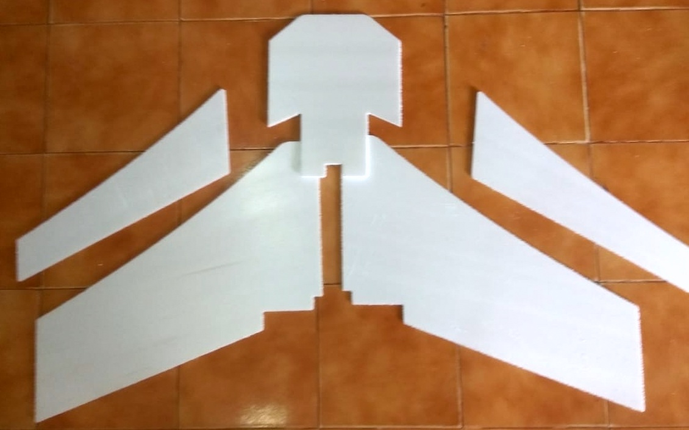

# FOS_UAV

The aim of this project is to develop an open source aerial mapping platform using standard hardware and to develop a workflow from data acquisition to data processing. 

FOS UAV is part of the Drone Research Program by [ICFOSS](https://icfoss.in/) (International Center for Free and Open Source Software)

## Overview

Most UAV's today are multirotors, they have the advantage of being able to hover and carry more payload like sensors and other auxilaries. But with the current battery technology, multirotors have a flight time in the range of 15- 20 mins, without compromising on the payload. They make good inspection drones in tight spots and hard to reach places. But because of the way they fly, they brun through a lot of  power, hence limiting the flight time and maximum range.

Fixed winged aircrafts fly on the principle of aerodynamic lift and are far more efficient at covering ground than multirotors. Even though they are considerably harder to design and build, they make up for with efficiency.

Our goal is to build a suitable fixed wing platform that can carry the necessary payload and provide usable data for arieal mapping. The craft needs to carry a good GPS system, a downward facing camera for taking images, and be able to fly missions autonomysly.

Our constrains being, it must be simple to make, and easy to use. All the hardware and software are low cost and open-source, without sacrificing saftey and usability.

## Related projects
 [**4-Axis Hotwire Foam Cutter**](https://github.com/rahulsarchive/4AxisFoamCutter)  
 [**CNC Drag knife**](https://github.com/rahulsarchive/cncdragknife)  

# Mapping Process

The mapping is done by a process called **Photogrametry.** The UAV carries a camera which is angled down to take photos of the ground when the crafts flies overhead. The UAV then flies along a defined GPS way-point mission which covers the area to be apped with sufficient overlap. A software then reads all the images and then stiches them into an 3 dimensional orthomosaic.

Multiple data can be infered from the orthomosaic like, ground elevation, water level, cubic volume of materials. With suffient overlap and good camera altitudes, centimeter level accuracy can be obtained. But inorder for the process to work, the UAV must provide reasonably stable data over the entire course of the mission.

# Software

## Ardupilot

Ardupilot is one of the most advanced open source autopilot solution, it has been there the longest and has an active community developing it. The firmware support a wide range of vechiles from airborne to terrestrial and even underwater. It is paired with a suitable ground control software to bring out is full functionalities.

In the latest release of Ardupilot they moved onto the Chibios platform and have now extended support for some of the common STM32 F4 flight controllers like the Omnibus F4 and the Matek F405 wing. We will be using this version and testing the features, the new firmware is still in beta and being actively developed.

## INAV

Inav is a flight control software, which was forked from Clean Flight. The software supports both multi-rotors and fixed wings and has good GPS modes like Return to launch (RTH) etc. The software has a mission planner, which allows for setting full autopilot GPS way-point navigation. It supports a variety of Flight controller boards and is actively being developed by the community.

## Open drone maps

OpenDroneMap is an open source toolkit for processing aerial drone imagery. Open drone maps turns the images captures by the drone into three dimensional geographic data that can be used in combination with other geographic datasets.

it can process a collection of images into point clouds, Digital surface models, Digital Elevation Models etc.

## Mission planner

Mission Planner is a ground control station for Plane, Copter and Rover. It can be used as a configuration utility or as a dynamic control supplement for your autonomous vehicle. It can be used to configure and tune your vehicle, plan and load autonomus gps way-point missions. With proper telemetry hardware, it can provide the live status of the vehicle, record telemetry data and operate the vehicle in FPV (first person view)

# Hardware

## Design consideration

The flight characteristics need to be kept in mind when choosing an aircraft. We wanted to keep thing simple, and minimze the number of moving components. Hence no tail. The aircraft will be a flying wing,simple and monolithic in construction, good performance and agility.

### Wing Aerodynamics 101

The two most important parameters when desiging an aircraft are the **Center of Gravity (COG)** and the **Center of Pressure (COP)**. The COG is the point where the weight of the aircraft acts and the COP is the point where the aerodynamic lift forces act. For the plane to be  stable, the COG must be in front of the COP. But this means the airplane has a tendency to nose down when flying. Thats where the tail comes in, the tail on a conventional airplane is set at a slightly downward angle compared to the wing, a term known as Decolage.

So the wing is lifting up and the tail is pushing down to keep the plane stable. If the COG is too far forward the wing has to push down even more and the wing has to make more lift to counter this effect. The inverse is also true, if the COG is too far back then the tail has to push up to keep the plane level, this is not a stable condition and its very difficult to fly a tail-heavy plane.

A wing emulates a stable flying conditon by having a forward COG and using its Elevons (Elevator+ Aeilerons) to pitch the wing up, A term known as **Reflex** in which the elevons are kept at a slight up to push the tail down and pitch up the wing. This is not without consequences, the more forward the COG the more the elevons have to pitch up, there by creating more induced drag. The next parameter which influences the COG and hence the stability is the **Sweep Angle**.

 Sweep is importart because it provides leverage for the COG to act. The COG needs to be at about 25-30% of the chord, in a rectangular wing, this is very close to the leading edge and will not provide enough leverage to balance the COG, so we need a long fuselage in front of the wing to carry the weight.

In a wing, the CG needs to be at about 20-30% of the **Mean aerodynamic chord**, whcih takes into account the root and tip chord and the sweep angle. In simple terms, the more the sweep, the farther back the COG can be and the more leverage you can get. But the more the sweep the less the lift is produces per wingspan. Sweep also has another effect, it acts like a **Dihedral**

A **Dihedaral** is a slight angle between the wings to provide stability. When one wing dips, it produces more lift than the other wing and the aircraft comes back to level. A side effect being, it will cause the wing to wobble, as the side facing the wind will have more lift than the trailing wing.

Flying wings are a lot harder to control as they are inherently unstable aircrafts. They are very sensitive to the changes in Center of Gravity (CG) and flying them manually is a skill.

Since our objective is to get stable data, flying them manually is not an option. This is where a flight controller comes in, it will keep the craft stable and provide additional features.

### Choosing an Airfoil 

In our version #2 build, we used the Clark y airfoil for the wing but it did not perform as well as we expected, after a bit of research on tip stalling and how to avoid it in a wing, we stumbled upon the **KFm airfoils**. On paper they seemed very good, so we decided to try them out.

The KF stands for Kline and Foggleman who were the designers of the KF airfoils. Unlike a conventional smooth airfoil. The KFm airfoil uses a series of layers to create stepped airfoils.

There are a number of KF variations, That use a combination of layers and positioning to produce a wing that can be made to emulate what a normal wing airfoil profiles.

Drawn up by Dick Kline these give some basic guide numbers  for the various combinations that have been tried. The guide numbers however are open to changes, going thinner will always work, going a bit thicker will often work, go too thick and it wont work. 

The percentage thickness refers to each sections total thickness vs the total chord of the wing, and not the height of the step. The height of the step is only determined by the thickness of your foam sheet. Steps can be raised to give more height and the step effect increases proportionaly with both height and air speed.

The basic stepped airfoil idea is that there will be a vortex produced behind each step that fills in the gap and lets the air flow over over the wing as though  the gap was solid and profiled.

For more details, check the RCgroups form on KFm theory and science.

[Kline-Fogleman-(KFm) Airfoils Advanced Theory Science](https://www.rcgroups.com/forums/showthread.php?1296458-**-Kline-Fogleman-(KFm)-Airfoils-Advanced-Theory-Science-**)

#### Some positive characteristics of KFm airfoils

1. It can handle a wide range of speeds form very slow to fast.  
2. It has much greater range for its center of gravity, it could be moved as much as 40% back, since the entire rear section of the wing is producing lift.  
3. It has very good stall characterisitcs and it retards tip stalling in a flying wing.  

### Power plant selection
	
The power plant in an electric aircraft is not just the Motor alone, but a combination of Motor, Propeller, and the battery. The battery can be thought of as both the energy source and the supercharger. When a motor is under load, it will pull a lot of amps, and the battery must be capable of supplying it.

Batteries are rated for their capacity and discharge rating. The capacity is the totoal amount of charge it can hold, bigger mAh gives longer flight times, but are also heavy. The discharge rating, denoted by 'C rating' is the max amount of current it can deliver at a time.

**Max current from battery = mAh x C rating.**

Select good batteries with high discharge rating, so that it can keep up with the motor.

The motors are rated in watts for the amount of power they deliver. Now how they deliver that power depends on the motor specifications namely,

1. Higher Kv motor spin faster, use smaller propellers, consumes a lot of current and are generally used for high speed aircraft.  
2. Lower Kv motor spin slower, use large propeller, produce lots of thrust, consumes less current, Generally used for larger planes with big props.  
3. The numbers on the motors generally indicate the size of the stator eg - 2212 1000kv motor, means stator dia is 22 mm and height is 12 mm.  
4. Larger diameter motors produce more thrust. Taller motors are stable at higher speeds.  

The propeller converts the mechanical energy from the motor into thrust. They are specified by their diameter and pitch. A "5X4 prop" has 5 inch diamter and 4 inch pitch. 

Generally,

1. Larger props produce more thrust, smaller props are more responsive.  
2. Always match motor to propeller. Lower Kv pairs with larger props and vice versa.    
3. For efficiency, go for the larges prop you can fit on the aircraft.  
4. Larger props produce more thrust, higher pitch gives faster speed.

### Flight controller

A Flight controller is basically an inertial measurement unit (IMU) plus a couple of sensors and a processor to read the sensors and act on the motors. It is constantly monitoring the orientation of the craft and trying to keep it level against outside disturbances. Most flight controller can run software which provides a host of abilities like GPS navigation, Auto-land/take-off etc.

There are a many open-source flight controllers designed for fixed wing like the **APM** and **Pixhawk**. But we can use the mini race quad boom to get cheap and efficient flight controllers.

Most mini quads today use a flightcontroller which has an STM32 chip on it, depending on the performance required, they range from F1 to F7 series. we settled on an **STM32F4 flight controller** which is a happy medium between performance and the number of devices that can be connected to it.

The flight controller needs software to run. There are couple of opensource softwares to choose from like Ardupilot, Betaflight, Cleanflight, INAV etc. Most softwares are geared towards multirotors but there are a few which support fixed wing crafts.

We chose Ardupilot as the flight control software as it met all the requirements and has good mission planning capabilities.

## Hardware 

The hardware is low cost and reliable, and can be obtained off-the-shellf

### Bill of Materials

| Sl No | Item | Description | Qty |
| --- | --- | --- | :--: |
| 1.	| **Matek F405 wing** | STM32F405 Flight Controller | **1** |
| 2.	| **Beitian BN-880 GPS module** | GPS Receiver | **1** |
| 3.	| **DYS D3536  1400KV** | 1000Kv 700W motor | **1** |
| 4.	| **SkyWalker 60A Esc** | 60A ESC | **1** |
| 5.	| **Towerpro MG90S Servo** | 9g Metal Gear Servo | **2** |
| 6.	| **Pushrod connectors** | Servo pushrod connectors | **2** |
| 7.	| **Gemfan 9X6 Prop** | 9X6 prop | **1** |
| 8.	| **Tattu 5000mAh 30C** | Lipo Battery | **1** |
| 9.	| **Frsky S8R Receiver** | Frsky Telemetry receiver | **1** |
| 10.	| **Sik Telemetry Radio 433Mhx** | Dual-way Telemetry Radio | **1** |
| 11.	| **5mm Depron Sheet** | 5mm XPS Sheet | **10** |

## Version 4.0 (Stingray, KFM6)

Wingspan: 1250mmm   
Sweep: 30 deg  
Root chord: 380mm
Tip chord: 220mm
AUW: 1300g  
Power plant: 3536 1400kv motor (9X6 prop) 

Considering all the things we learned from the previous model we decided to build a new model with some modifications like, switching from to a KFm6 airfoil and building the plane out of 5mm Depron, which is much lighter.

Cutting Depron in Shopbot CNC mill. The frame is made form multiple sheets stacked on top.

The arrangement showing how the pieces fit together.

The model after assembling.

Finishes sticking all the parts together and made a fuselage out of depron for housing all the electronics.

The Elevons sanded to give the airfoil shape. and attached to body uing Nylon hinges.

The finished airframe with a painted body and tape covering to protect it from damage.

The wing flies well, it needs a 5000mah battery and a Gopro in front to balance out the CG but once its balanced, it flies well, good glide slope and stall characteristics. The KFm6 seems to work well with this airframe.

## Resources 

